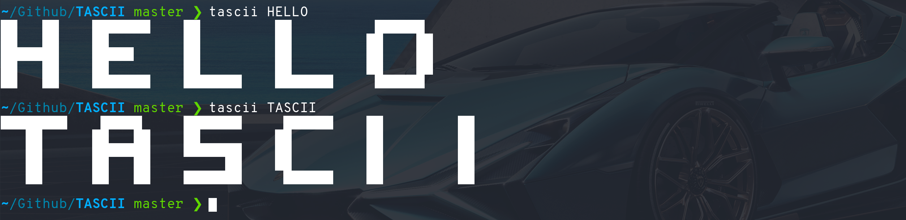

# TASCII
> 📜 Command-line text to ASCII art generator.

## 🔌 Installation
Install the [latest release](https://github.com/raad1masum/TASCII/releases).

**OR**

```sh
git clone https://github.com/raad1masum/TASCII.git; cd TASCII; make install
```

## 🚀 Usage
Just run `tascii <text>`


## 👨‍💻 Contact

Linkedin: [Raadwan Masum](https://www.linkedin.com/in/raadwan-masum-9147bb1a5)
<br>
Github: [raad1masum](https://github.com/raad1masum)
<br>
Devpost: [Raadwan masum](https://devpost.com/raad1masum)
